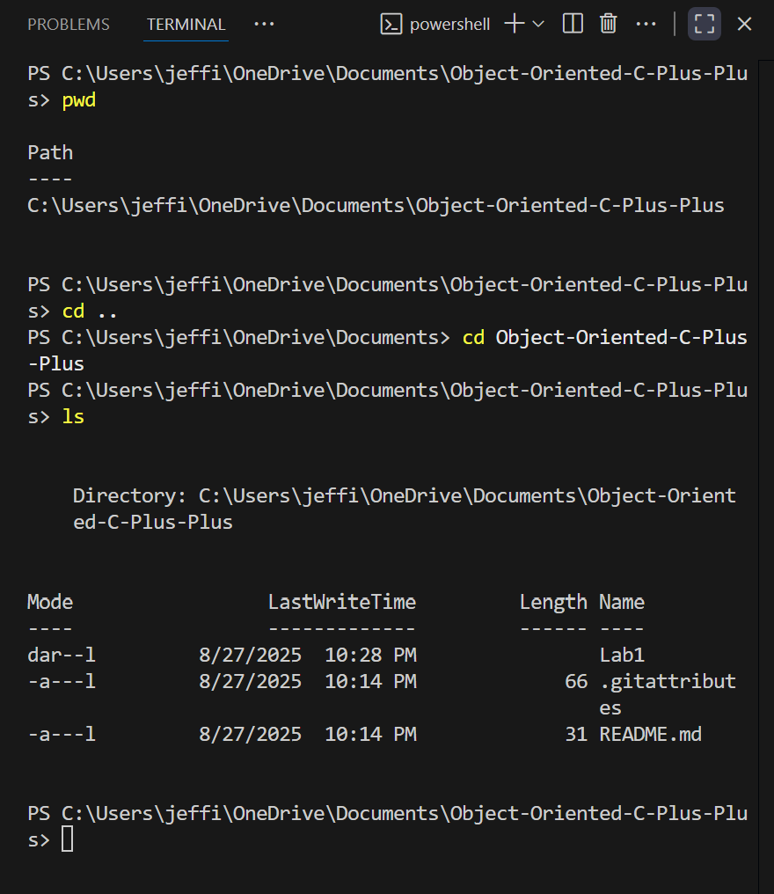
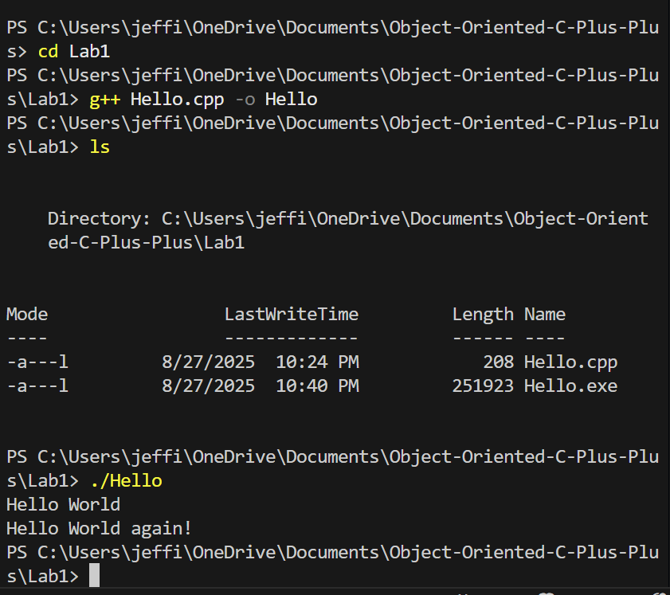

# Object-Oriented-C-Plus-Plus
## Lab 1
Lab 1 [Github Repo](https://github.com/mjlt42/Object-Oriented-C-Plus-Plus/tree/3c285191c3277c8eb08b30980ab164fff8f7a2ef/Lab%201)

> CLI arguments: 

> Hello.cpp outputs:

